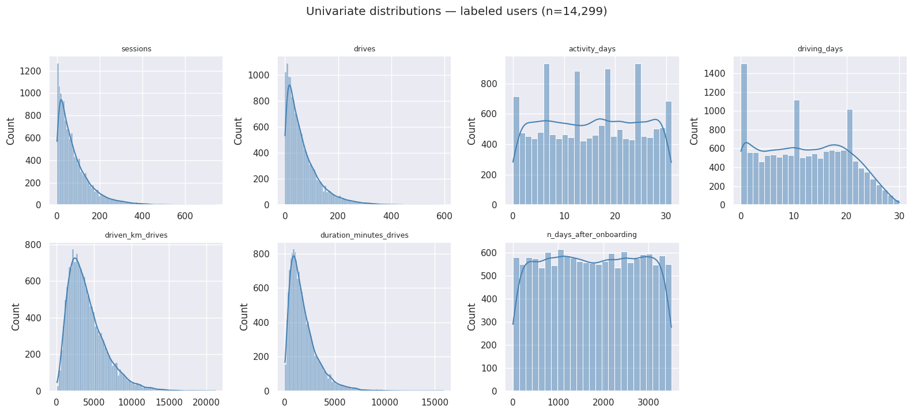
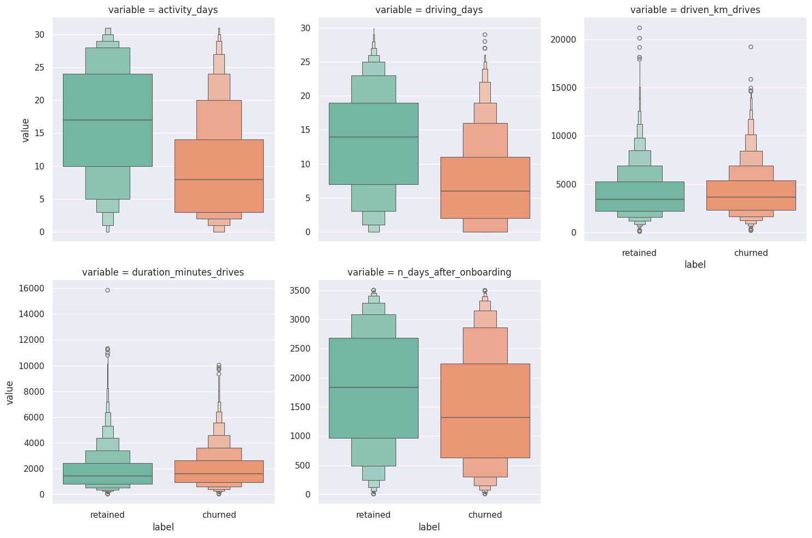
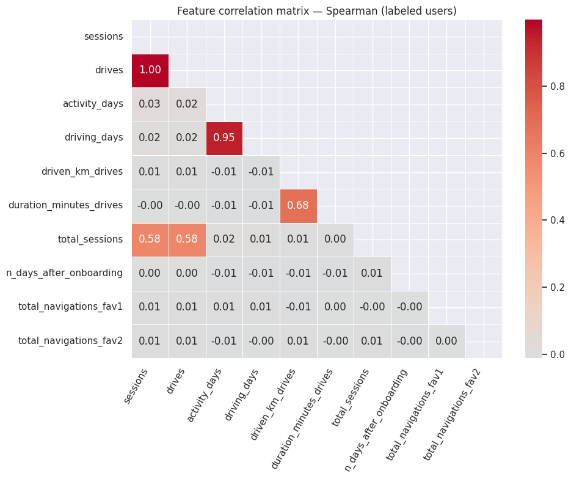
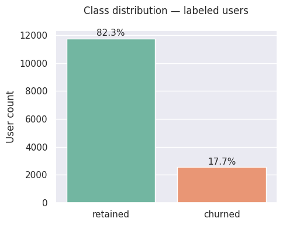
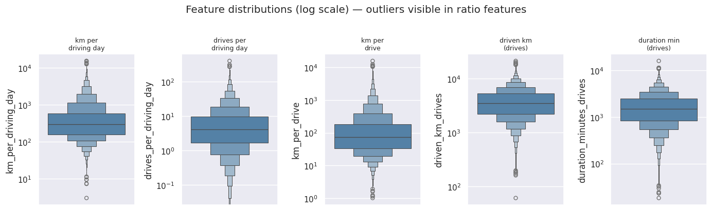
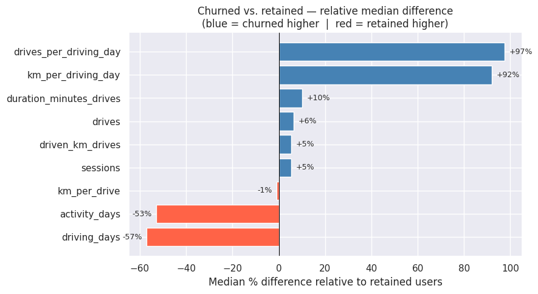
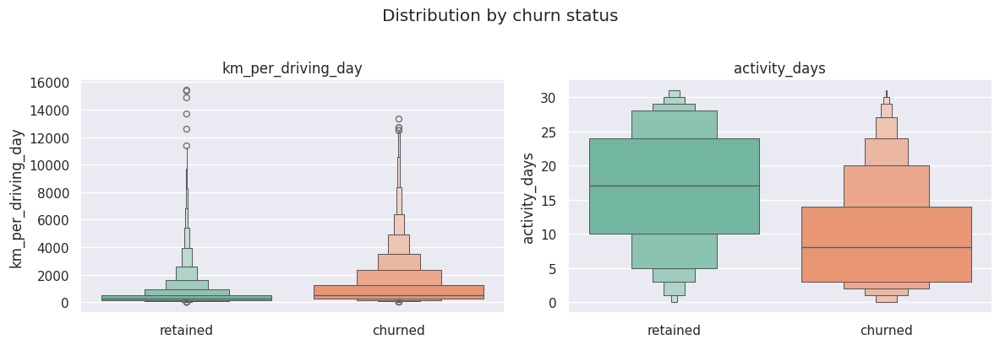
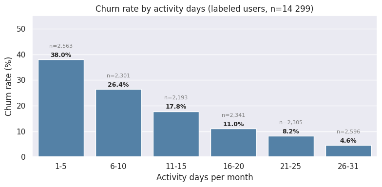
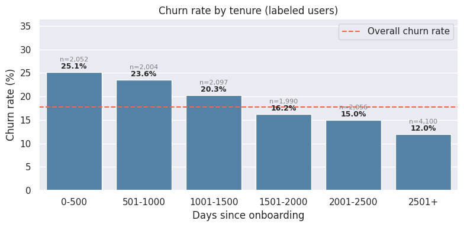
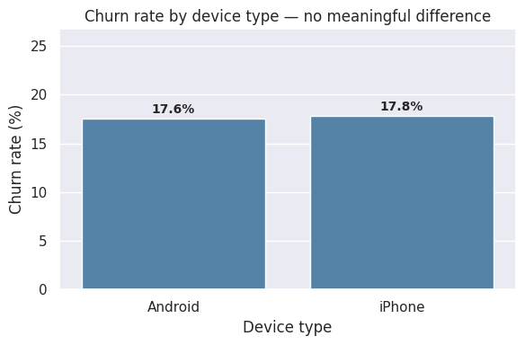

# Waze User Churn — Exploratory Data Analysis

*April 2026*

---

## Waze User Churn — Exploratory Data Analysis

 

### Business question
Which behaviours and characteristics distinguish users who churn from those who are retained?
 

### Table of Contents

1. Setup (technical setup: skipped)
2. [Data](#2-data)
   - 2.1 [Discovery](#21-discovery)
   - 2.2 [Missing values](#22-missing-values)
   - 2.3 [Univariate distributions](#23-univariate-distributions)
   - 2.4 [Activity vs. churn — bivariate comparison](#24-activity-vs-churn--bivariate-comparison)
   - 2.5 [Feature correlations](#25-feature-correlations)

3. [Label distribution](#3-label-distribution)
4. [Churn profiles](#4-churn-profiles)
   - 4.1 [Outlier check](#41-outlier-check)
   - 4.2 [Median profiles by churn status](#42-median-profiles-by-churn-status)
   - 4.3 [Churn rate by activity days](#43-churn-rate-by-activity-days)
   - 4.4 [Churn rate by tenure](#44-churn-rate-by-tenure)
5. [Statistical significance](#5-statistical-significance)
6. [Device breakdown](#6-device-breakdown)
7. [Summary](#7-summary)

---

## Key Findings

 

> **~18% monthly churn** in the labeled population (82/18 class split).

 

| Finding | Detail |
|---|---|
| Strongest churn signal | `km_per_driving_day` (+92%) and `drives_per_driving_day` (+97%) — high-intensity, low-frequency users |
| Strongest retention signal | `activity_days` — retained users open the app on **twice as many days** per month |
| Activity days gradient | Churn drops from **38%** (≤5 active days) to **4.6%** (26+ days) — monotonically |
| Device type | Not a predictor: iPhone 17.8% vs Android 17.6% |
| Missing labels | 700 rows (~4.7%), MCAR — safe to drop |

---

## 2. Data

### 2.1 Discovery
- have a look at the first few observations
- have a look at a random sample (avoid potential bias at the top of the dataframe)
- use the custom `infos` function (or `df.info` and `df.describe`)

---

#### 2.1.1  Data Dictionary

| Column name | Type | Description |
|---|---|---|
| ID | int | A sequential numbered index |
| label | obj | Binary target variable ("retained" vs "churned") for if a user has churned anytime during the course of the month |
| sessions | int | The number of occurrence of a user opening the app during the month |
| drives | int | An occurrence of driving at least 1 km during the month |
| device | obj | The type of device a user starts a session with |
| total_sessions | float | A model estimate of the total number of sessions since a user has onboarded |
| n_days_after_onboarding | int | The number of days since a user signed up for the app |
| total_navigations_fav1 | int | Total navigations since onboarding to the user's favorite place 1 |
| total_navigations_fav2 | int | Total navigations since onboarding to the user's favorite place 2 |
| driven_km_drives | float | Total kilometers driven during the month |
| duration_minutes_drives | float | Total duration driven in minutes during the month |
| activity_days | int | Number of days the user opens the app during the month |
| driving_days | int | Number of days the user drives (at least 1 km) during the month |

---

#### 2.1.2 Overview of the dataset (head)

|    |   ID | label    |   sessions |   drives |   total_sessions |   n_days_after_onboarding |   total_navigations_fav1 |   total_navigations_fav2 |   driven_km_drives |   duration_minutes_drives |   activity_days |   driving_days | device   |
|---:|-----:|:---------|-----------:|---------:|-----------------:|--------------------------:|-------------------------:|-------------------------:|-------------------:|--------------------------:|----------------:|---------------:|:---------|
|  0 |    0 | retained |        283 |      226 |           296.75 |                      2276 |                      208 |                        0 |            2628.85 |                   1985.78 |              28 |             19 | Android  |
|  1 |    1 | retained |        133 |      107 |           326.9  |                      1225 |                       19 |                       64 |           13715.9  |                   3160.47 |              13 |             11 | iPhone   |
|  2 |    2 | retained |        114 |       95 |           135.52 |                      2651 |                        0 |                        0 |            3059.15 |                   1610.74 |              14 |              8 | Android  |
|  3 |    3 | retained |         49 |       40 |            67.59 |                        15 |                      322 |                        7 |             913.59 |                    587.2  |               7 |              3 | iPhone   |
|  4 |    4 | retained |         84 |       68 |           168.25 |                      1562 |                      166 |                        5 |            3950.2  |                   1219.56 |              27 |             18 | Android  |

---

#### 2.1.3 Summary statistics of the dataset

|                         |   nulls |   nulls_pct | dtypes   |   nunique |   count |    mean |     std |    min |     25% |     50% |      75% |      max |
|:------------------------|--------:|------------:|:---------|----------:|--------:|--------:|--------:|-------:|--------:|--------:|---------:|---------:|
| label                   |     700 |         4.7 | str      |         2 |     nan |  nan    |  nan    | nan    |  nan    |  nan    |   nan    |   nan    |
| device                  |       0 |         0   | str      |         2 |     nan |  nan    |  nan    | nan    |  nan    |  nan    |   nan    |   nan    |
| ID                      |       0 |         0   | int64    |     14999 |   14999 | 7499    | 4329.98 |   0    | 3749.5  | 7499    | 11248.5  | 14998    |
| sessions                |       0 |         0   | int64    |       469 |   14999 |   80.63 |   80.7  |   0    |   23    |   56    |   112    |   743    |
| drives                  |       0 |         0   | int64    |       401 |   14999 |   67.28 |   65.91 |   0    |   20    |   48    |    93    |   596    |
| n_days_after_onboarding |       0 |         0   | int64    |      3441 |   14999 | 1749.84 | 1008.51 |   4    |  878    | 1741    |  2623.5  |  3500    |
| total_navigations_fav1  |       0 |         0   | int64    |       730 |   14999 |  121.61 |  148.12 |   0    |    9    |   71    |   178    |  1236    |
| total_navigations_fav2  |       0 |         0   | int64    |       287 |   14999 |   29.67 |   45.4  |   0    |    0    |    9    |    43    |   415    |
| activity_days           |       0 |         0   | int64    |        32 |   14999 |   15.54 |    9.01 |   0    |    8    |   16    |    23    |    31    |
| driving_days            |       0 |         0   | int64    |        31 |   14999 |   12.18 |    7.82 |   0    |    5    |   12    |    19    |    30    |
| total_sessions          |       0 |         0   | float64  |     14999 |   14999 |  189.96 |  136.41 |   0.22 |   90.66 |  159.57 |   254.19 |  1216.15 |
| driven_km_drives        |       0 |         0   | float64  |     14999 |   14999 | 4039.34 | 2502.15 |  60.44 | 2212.6  | 3493.86 |  5289.86 | 21183.4  |
| duration_minutes_drives |       0 |         0   | float64  |     14999 |   14999 | 1860.98 | 1446.7  |  18.28 |  836    | 1478.25 |  2464.36 | 15851.7  |

---

#### 2.2 Missing values

#### 2.2.1 Missing values - summary statistics comparison

The whole dataset is split into two subsets: rows with missing values, and rows without missing values. The difference between both summary statistics is calculated in the last table.

Rows with missing values: 
|       |       ID |   sessions |   drives |   total_sessions |   n_days_after_onboarding |   total_navigations_fav1 |   total_navigations_fav2 |   driven_km_drives |   duration_minutes_drives |   activity_days |   driving_days |
|:------|---------:|-----------:|---------:|-----------------:|--------------------------:|-------------------------:|-------------------------:|-------------------:|--------------------------:|----------------:|---------------:|
| count |   700    |     700    |   700    |           700    |                    700    |                   700    |                   700    |             700    |                    700    |          700    |         700    |
| mean  |  7405.58 |      80.84 |    67.8  |           198.48 |                   1709.3  |                   118.72 |                    30.37 |            3935.97 |                   1795.12 |           15.38 |          12.13 |
| std   |  4306.9  |      79.99 |    65.27 |           140.56 |                   1005.31 |                   156.31 |                    46.31 |            2443.11 |                   1419.24 |            8.77 |           7.63 |
| min   |    77    |       0    |     0    |             5.58 |                     16    |                     0    |                     0    |             290.12 |                     66.59 |            0    |           0    |
| 25%   |  3744.5  |      23    |    20    |            94.06 |                    869    |                     4    |                     0    |            2119.34 |                    779.01 |            8    |           6    |
| 50%   |  7443    |      56    |    47.5  |           177.26 |                   1650.5  |                    62.5  |                    10    |            3421.16 |                   1414.97 |           15    |          12    |
| 75%   | 11007    |     112.25 |    94    |           266.06 |                   2508.75 |                   169.25 |                    43    |            5166.1  |                   2443.96 |           23    |          18    |
| max   | 14993    |     556    |   445    |          1076.88 |                   3498    |                  1096    |                   352    |           15135.4  |                   9746.25 |           31    |          30    |

___
Rows without missing values: 
|       |       ID |   sessions |   drives |   total_sessions |   n_days_after_onboarding |   total_navigations_fav1 |   total_navigations_fav2 |   driven_km_drives |   duration_minutes_drives |   activity_days |   driving_days |
|:------|---------:|-----------:|---------:|-----------------:|--------------------------:|-------------------------:|-------------------------:|-------------------:|--------------------------:|----------------:|---------------:|
| count | 14299    |   14299    | 14299    |         14299    |                  14299    |                 14299    |                 14299    |           14299    |                  14299    |        14299    |       14299    |
| mean  |  7503.57 |      80.62 |    67.26 |           189.55 |                   1751.82 |                   121.75 |                    29.64 |            4044.4  |                   1864.2  |           15.54 |          12.18 |
| std   |  4331.21 |      80.74 |    65.95 |           136.19 |                   1008.66 |                   147.71 |                    45.35 |            2504.98 |                   1448.01 |            9.02 |           7.83 |
| min   |     0    |       0    |     0    |             0.22 |                      4    |                     0    |                     0    |              60.44 |                     18.28 |            0    |           0    |
| 25%   |  3749.5  |      23    |    20    |            90.46 |                    878.5  |                    10    |                     0    |            2217.32 |                    840.18 |            8    |           5    |
| 50%   |  7504    |      56    |    48    |           158.72 |                   1749    |                    71    |                     9    |            3496.55 |                   1479.39 |           16    |          12    |
| 75%   | 11257.5  |     111    |    93    |           253.54 |                   2627.5  |                   178    |                    43    |            5299.97 |                   2466.93 |           23    |          19    |
| max   | 14998    |     743    |   596    |          1216.15 |                   3500    |                  1236    |                   415    |           21183.4  |                  15851.7  |           31    |          30    |

___

Difference: 
|      |        ID |   sessions |     drives |   total_sessions |   n_days_after_onboarding |   total_navigations_fav1 |   total_navigations_fav2 |   driven_km_drives |   duration_minutes_drives |   activity_days |   driving_days |
|:-----|----------:|-----------:|-----------:|-----------------:|--------------------------:|-------------------------:|-------------------------:|-------------------:|--------------------------:|----------------:|---------------:|
| mean | -0.013232 |   0.002639 |   0.008005 |         0.045021 |                 -0.02488  |                -0.025525 |                 0.024139 |          -0.02755  |                 -0.03848  |       -0.010518 |      -0.004686 |
| std  | -0.005644 |  -0.009365 |  -0.010347 |         0.031103 |                 -0.00334  |                 0.054986 |                 0.020647 |          -0.025325 |                 -0.020266 |       -0.027742 |      -0.027203 |
| min  |  1        | nan        | nan        |         0.960554 |                  0.75     |               nan        |               nan        |           0.791668 |                  0.725447 |      nan        |     nan        |
| 25%  | -0.001335 |   0        |   0        |         0.03826  |                 -0.010932 |                -1.5      |               nan        |          -0.046229 |                 -0.078525 |        0        |       0.166667 |
| 50%  | -0.008196 |   0        |  -0.010526 |         0.10458  |                 -0.059679 |                -0.136    |                 0.1      |          -0.022036 |                 -0.045533 |       -0.066667 |       0        |
| 75%  | -0.022758 |   0.011136 |   0.010638 |         0.047048 |                 -0.047334 |                -0.051699 |                 0        |          -0.025914 |                 -0.0094   |        0        |      -0.055556 |
| max  | -0.000333 |  -0.336331 |  -0.339326 |        -0.129332 |                 -0.000572 |                -0.127737 |                -0.178977 |          -0.399594 |                 -0.626443 |        0        |       0        |

The values **are very close**, a sign that there is no apparent difference in the subset of observations with missing values.
Let's now check how null values are split across device type (the other categorical value).

---

#### 2.2.2 Missing values - by device type
Overall: 
|    |   label_nulls_pct |
|---:|------------------:|
|  0 |              4.67 |

By device type: 
| device   |   device_count |   number_of_nulls |   null_pct |
|:---------|---------------:|------------------:|-----------:|
| Android  |           5327 |               253 |       4.75 |
| iPhone   |           9672 |               447 |       4.62 |

**Again, values are close** to 4.7% in both device categories.

---

#### 2.2.3 Missing values - device ratio

Count and %age of iPhone users and Android users overall 
| device   |   device_count |   pct |
|:---------|---------------:|------:|
| iPhone   |           9672 |  64.5 |
| Android  |           5327 |  35.5 |

Count and %age of iPhone users and Android in the subset with nulls 

| device   |   device_count |   pct |
|:---------|---------------:|------:|
| iPhone   |            447 |  63.9 |
| Android  |            253 |  36.1 |

**Here again, the split is the same** with or without missing values  in both device type categories.

---

#### 2.2.4 Missing values - conclusion

> We can consider that the missing labels are **missing completely at random (MCAR)** — they can be dropped for the churn analysis without introducing bias.

|                         |   nulls |   nulls_pct | dtypes   |   nunique |   count |    mean |     std |    min |     25% |     50% |      75% |      max |
|:------------------------|--------:|------------:|:---------|----------:|--------:|--------:|--------:|-------:|--------:|--------:|---------:|---------:|
| label                   |       0 |           0 | str      |         2 |     nan |  nan    |  nan    | nan    |  nan    |  nan    |   nan    |   nan    |
| device                  |       0 |           0 | str      |         2 |     nan |  nan    |  nan    | nan    |  nan    |  nan    |   nan    |   nan    |
| ID                      |       0 |           0 | int64    |     14299 |   14299 | 7503.57 | 4331.21 |   0    | 3749.5  | 7504    | 11257.5  | 14998    |
| sessions                |       0 |           0 | int64    |       467 |   14299 |   80.62 |   80.74 |   0    |   23    |   56    |   111    |   743    |
| drives                  |       0 |           0 | int64    |       398 |   14299 |   67.26 |   65.95 |   0    |   20    |   48    |    93    |   596    |
| n_days_after_onboarding |       0 |           0 | int64    |      3432 |   14299 | 1751.82 | 1008.66 |   4    |  878.5  | 1749    |  2627.5  |  3500    |
| total_navigations_fav1  |       0 |           0 | int64    |       724 |   14299 |  121.75 |  147.71 |   0    |   10    |   71    |   178    |  1236    |
| total_navigations_fav2  |       0 |           0 | int64    |       282 |   14299 |   29.64 |   45.35 |   0    |    0    |    9    |    43    |   415    |
| activity_days           |       0 |           0 | int64    |        32 |   14299 |   15.54 |    9.02 |   0    |    8    |   16    |    23    |    31    |
| driving_days            |       0 |           0 | int64    |        31 |   14299 |   12.18 |    7.83 |   0    |    5    |   12    |    19    |    30    |
| total_sessions          |       0 |           0 | float64  |     14299 |   14299 |  189.55 |  136.19 |   0.22 |   90.46 |  158.72 |   253.54 |  1216.15 |
| driven_km_drives        |       0 |           0 | float64  |     14299 |   14299 | 4044.4  | 2504.98 |  60.44 | 2217.32 | 3496.55 |  5299.97 | 21183.4  |
| duration_minutes_drives |       0 |           0 | float64  |     14299 |   14299 | 1864.2  | 1448.01 |  18.28 |  840.18 | 1479.39 |  2466.93 | 15851.7  |

---

#### 2.3 Univariate distributions

|                         |   skewness |
|:------------------------|-----------:|
| sessions                |       2.02 |
| drives                  |       1.98 |
| activity_days           |      -0.01 |
| driving_days            |       0.09 |
| driven_km_drives        |       1.3  |
| duration_minutes_drives |       1.76 |
| n_days_after_onboarding |      -0    |

---

#### 2.4 Activity vs. churn — bivariate comparison

Seaborn can help us visualize the relationship between features split by churn label.
- `activity_days`, `driving_days` and `n_days_after_onboarding` show a difference
- `driven_km_drives` and `duration_minutes_drives` are similar

---

#### 2.5 Feature correlations

Note: we use the Spearman rank correlation — robust to the right-skewed distributions seen in section 2.3

**Key observations**
- `sessions` and `drives` are perfectly correlated (r = 1.00) — only one needs to enter a model.
- `activity_days` and `driving_days` are highly correlated (r = 0.95) — same redundancy.
- `driven_km_drives` and `duration_minutes_drives` are moderately correlated (r = 0.70).
- `n_days_after_onboarding` is largely independent of activity metrics — it captures tenure, not intensity.
- `total_navigations_fav1` and`2` show weak correlations across the board — favourites usage is largely independent of activity intensity

---

#### 2.6 Feature–label correlation

#### 2.6.1 Feature–label correlation table

|                         |   spearman_r | direction       |
|:------------------------|-------------:|:----------------|
| activity_days           |        -0.3  | retained higher |
| driving_days            |        -0.3  | retained higher |
| n_days_after_onboarding |        -0.13 | retained higher |
| duration_minutes_drives |         0.04 | churned higher  |
| total_navigations_fav1  |         0.04 | churned higher  |
| drives                  |         0.03 | churned higher  |
| sessions                |         0.03 | churned higher  |
| driven_km_drives        |         0.03 | churned higher  |
| total_sessions          |         0.02 | churned higher  |
| total_navigations_fav2  |         0.01 | churned higher  |

Negative correlations indicate the feature is *higher* for retained users; positive values indicate it is *higher* for churned users.

**`activity_days`** is the single strongest (negative) predictor — retained users open the app far more days. The intensity ratios (`km_per_driving_day`, `drives_per_driving_day`) are the strongest positive predictors, consistent with the median profiles in section 4.

---

## 3. Label distribution

**The dataset is imbalanced — ~18% churn.**

---

## 4. Churn profiles

We compare median values for churned vs. retained users across all numeric features.
- `km_per_drive`
- `km_per_driving_day`
- `drives_per_driving_day`

---

#### 4.1 Outlier check

The ratio features span several orders of magnitude (up to 15,000+ km/day for edge cases with a single driving day), so a **log scale** is used to make both the bulk of the distribution and the extreme outliers visible in a single plot.

___

#### 4.1 Outlier check - table

| feature                 |   upper_fence (3xIQR) |   n_outliers |   pct_outliers |     max |
|:------------------------|----------------------:|-------------:|---------------:|--------:|
| km_per_driving_day      |                1893.7 |          885 |           6.65 | 15420.2 |
| drives_per_driving_day  |                  33.3 |          808 |           6.07 |   395   |
| km_per_drive            |                 626.1 |         1102 |           7.76 | 15777.4 |
| driven_km_drives        |               14547.9 |           35 |           0.24 | 21183.4 |
| duration_minutes_drives |                7347.2 |           96 |           0.67 | 15851.7 |

**Ratio features carry significant outliers; raw volume features do not.**
- `km_per_drive`, `km_per_driving_day`, `drives_per_driving_day` each have **6–8% extreme values** (up to 15,000+ km/day) — artefacts of a small denominator (e.g. 1 driving day) inflating the ratio.
- `driven_km_drives` and `duration_minutes_drives` have **<1% outliers**: raw totals are bounded by the length of the month.

---

#### 4.2 Median profiles by churn status

We compare median values for churned vs. retained users across numeric and engineered features, and visualise the relative difference to make the contrast immediately readable.

Columns are selected to scope monthly behavioral features only, others listed below are analyzed separately or excluded to avoid mixing timescales.
- `total_sessions` is a model estimate of all-time sessions, not monthly
- `n_days_after_onboarding` is tenure, analyzed separately in 4.4
- `total_navigations_fav1` and `2` are cumulative since onboarding

---

#### 4.2.1  Median profiles by churn status - table

| label / metric          |   churned |   retained |   diff |   diff_pct |
|:------------------------|----------:|-----------:|-------:|-----------:|
| sessions                |      59   |       56   |    3   |        5.4 |
| drives                  |      50   |       47   |    3   |        6.4 |
| activity_days           |       8   |       17   |   -9   |      -52.9 |
| driving_days            |       6   |       14   |   -8   |      -57.1 |
| driven_km_drives        |    3652.7 |     3464.7 |  188   |        5.4 |
| duration_minutes_drives |    1607.2 |     1458   |  149.1 |       10.2 |
| km_per_drive            |      73.5 |       74.1 |   -0.6 |       -0.8 |
| km_per_driving_day      |     523.1 |      272.6 |  250.5 |       91.9 |
| drives_per_driving_day  |       7.5 |        3.8 |    3.7 |       97.4 |

___
**Key observations on the median profiles:**
- Churned users have
    - **~2× as many drives per driving day** as retained users — they pack far more activity into fewer days
    - **~92% more km per driving day**
    - 3 more drives in average in the last month than retained users
    - ~200 more kilometers
    - 2.5 more hours
- Retained users
    - open the app on **twice as many days** per month
    - drives with the app on **more than twice as many days** per month

---

The boxplot on the left would not let us see how important `km_per_driving_day` is. On the other hand, we already saw in section 2.4 that `activity_days` had a different distribution between churned and retained user. The point here is to use multiple visualizations to not miss important features.

---

#### 4.3 Churn rate by activity days

**`activity_days` is the single clearest predictor in the dataset.**

---

#### 4.4 Churn rate by tenure

**Limitation — cross-sectional snapshot:** This dataset captures one month of activity with no information about *when* each user signed up relative to others. A flat churn-by-tenure line could mask cohort effects: a large inflow of low-engagement users in a given period would all churn early, inflating churn for recent cohorts — but that signal disappears when all cohorts are pooled into a single snapshot. To detect this, the analysis would need to be re-run as a **cohort analysis**: group users by sign-up month, track churn over time within each cohort, and compare cohort curves. That would reveal whether churn patterns are stable across cohorts or driven by a specific acquisition period.

---

## 5. Statistical significance

#### 5.1 Statistical significance - table

|    | feature                |   n_churned |   n_retained |   U_statistic |   p_value |   effect_r | sig   | effect   |
|---:|:-----------------------|------------:|-------------:|--------------:|----------:|-----------:|:------|:---------|
|  2 | activity_days          |        2536 |        11763 |   8.07522e+06 |         0 |       0.46 | ***   | medium   |
|  3 | driving_days           |        2536 |        11763 |   8.24221e+06 |         0 |       0.45 | ***   | medium   |
|  0 | km_per_driving_day     |        2143 |        11173 |   1.61304e+07 |         0 |       0.35 | ***   | medium   |
|  1 | drives_per_driving_day |        2143 |        11173 |   1.53573e+07 |         0 |       0.28 | ***   | small    |

 

**All four features are statistically significant at p < 0.001 (\*\*\*)**, confirming the median differences in section 4 are not sampling noise.

---

## 6. Device breakdown

---

## 7. Summary

| Finding | Detail |
|---|---|
| Overall churn rate | ~18% of labeled users |
| Missing labels | 700 rows (~4.7%), MCAR -- safe to drop |
| Strongest churn signal | `km_per_driving_day` (+92%) and `drives_per_driving_day` (+97%) |
| Strongest retention signal | `activity_days` -- retained users are 2x more active by day count |
| Activity days gradient | Churn drops monotonically as activity days increase |
| Statistical significance | All four key metrics significant at p < 0.001 (Mann-Whitney U) |
| Multicollinearity | `sessions`/`drives` and `activity_days`/`driving_days` are near-redundant pairs |
| Device type | No meaningful difference (iPhone 17.8% vs Android 17.6%) |

**Recommended next steps:**

1. **Feature engineering** -- the intensity metrics (`km_per_driving_day`, `drives_per_driving_day`) should be included as first-class features in any churn model.
2. **Class imbalance** -- the 82/18 split warrants oversampling (SMOTE) or class-weighted loss when building a classifier.
3. **Multicollinearity** -- drop one of each redundant pair (`drives`, `driving_days`) before modelling.
4. **Cohort analysis** -- this dataset is a single monthly snapshot, so churn-by-tenure reflects pooled cohorts. Re-running the tenure analysis by sign-up month would reveal whether churn patterns are stable or driven by a specific acquisition period (e.g. a campaign that attracted low-engagement users).

---

**Business interpretation:**

The data tells a consistent story: users who churn are *high-intensity, low-frequency* — they use Waze intensively on the few days they do drive, but do not open the app habitually. Retained users, by contrast, are *low-intensity, high-frequency* — they open the app on twice as many days and have made it part of their daily routine.

**1. Effort to reduce churn**
The highest-risk segment is users with ≤ 5 active days in a month, who churn at **38%** — more than 8× the rate of highly active users. A re-engagement strategy targeting low-frequency users (push notifications, commute reminders, feature discovery prompts) would directly address the highest-churn bucket. Any downstream churn model should prioritise `activity_days` and the intensity ratio features (`km_per_driving_day`, `drives_per_driving_day`) as primary inputs, and account for the 82/18 class imbalance through class weighting or resampling.

**2. Consider other approaches**
Maybe we don't want to target these kind of users (Uber drivers that already use other primary navigation app?)
Maybe this analysis is impacted by some marketing campaign that was done in the previous weeks.
